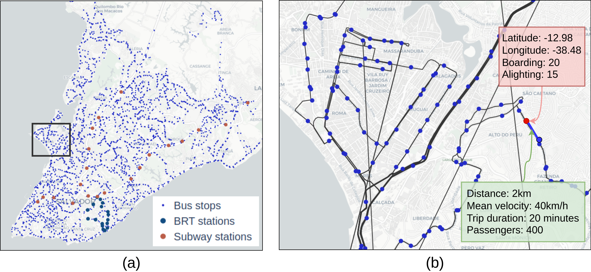

# SUNT — Salvador Urban Network Transportation

**SUNT** is the most comprehensive open public transportation dataset currently
available in the literature. Collected in **Salvador, Brazil**, between March 2024
and March 2025, it covers ~694 km² and serves nearly 3 million residents.

---

## At a Glance

| Feature | Value |
|---|---|
| City | Salvador, Brazil |
| Period | March 2024 – March 2025 |
| Temporal granularity | < 1 minute |
| Graph nodes (stops/stations) | 2,871 |
| Graph edges (routes) | 4,526 |
| Daily passengers | ~700,000 |
| Vehicles | ~2,000 |
| Lines | ~400 |
| Stops & stations | ~3,000 |
| License | CC BY 4.0 |

---

## Transportation Systems

=== "Regular Bus"
    - ~1,900 buses on ~400 lines
    - ~3,000 stops and stations
    - ~470,000 daily passengers

=== "Subway"
    - 2 lines, 20 stations, ~35 km
    - ~210,000 daily passengers

=== "BRT"
    - 3 lines, 20 stations, ~40 buses
    - ~30,000 daily passengers

---

## What Makes SUNT Unique

- **Passenger-level data**: boarding and *inferred* alighting for each trip.
- **Multiple data formats**: tabular (CSV), graph (nodes + edges), and temporal streams (5-min intervals).
- **Full pipeline transparency**: raw data (AVL, AFC, GTFS, LTI) and all processed outputs are public.
- **Recency**: collected 2024–2025, reflecting current urban infrastructure.

---

## Quick Links

- 📦 [Full dataset on Mendeley Data](https://data.mendeley.com/datasets/85fdtx3kr5/1)
- 🤗 [Processed data on Hugging Face](https://huggingface.co/datasets/labiaufba/PublicTransportationSunt)
- 💻 [GitHub Repository](https://github.com/LabIA-UFBA/SUNT)
- 📄 [Scientific Data paper (DOI: 10.1038/s41597-025-05674-6)](https://doi.org/10.1038/s41597-025-05674-6)

---

## How to Cite

See the [Citation page](citation.md) for BibTeX entries for both the dataset and the paper.
